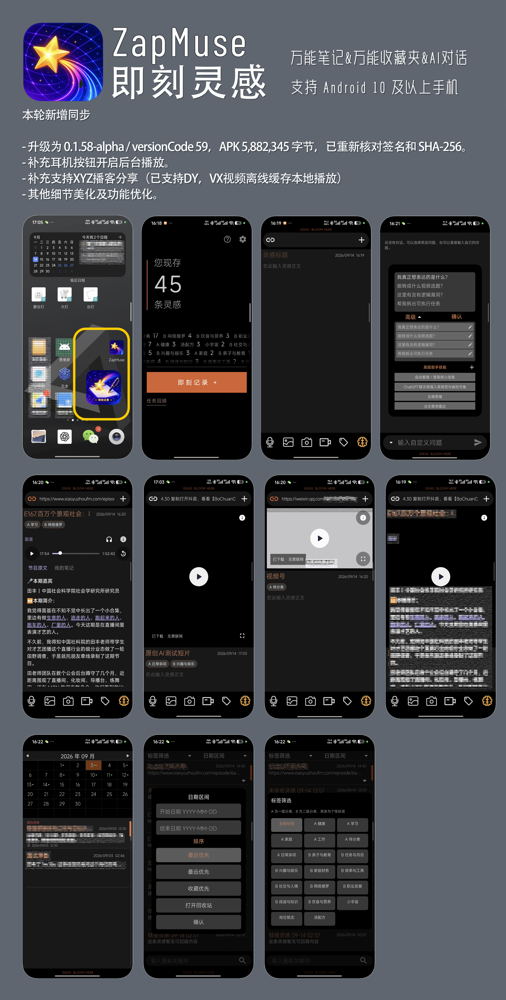

# ZapMuse · 即刻灵感

第一时间！最快速度进入记录状态！留下文字、链接、声音和画面，之后再用 AI 整理与回顾。

**如果这个工具对你有帮助，欢迎点右上角 ⭐ Star，方便以后找到，也支持我继续维护。**

**当前公开体验版：0.1.58-alpha · Android 10 及以上**
**[下载最新版 APK](https://github.com/bochuan0808/ZapMuse-Downloads/releases/download/v0.1.58-alpha/ZapMuse-v0.1.58-alpha.apk)** · [新版说明](https://github.com/bochuan0808/ZapMuse-Downloads/releases/tag/v0.1.58-alpha) · [历史版本](https://github.com/bochuan0808/ZapMuse-Downloads/releases)

## 新版功能总览

Android 10+｜30 天试用｜AI 需自行配置接口，第三方费用另计

作者整理的新版界面与功能展示，点击图片可查看高清原图。各媒体来源的支持范围与使用限制见下文。

## 这次有什么新变化

相较公开版 0.1.43-alpha：

- 原生音视频播放器可用右上角耳机按钮开启后台播放，返回桌面仍可继续听，系统媒体通知可暂停、继续、停止和拖动进度；视频在后台只播放声音。
- 播放控件闲置两秒隐藏，点击恢复；修复小宇宙正文上滑误跳 AI 页、图片加载后阅读位置复位，正文排版更紧凑。

- 小宇宙公开单集保存后可自动下载音频和 Shownotes 图片，原文与自己的笔记分开；下载完成后可离线听、读和续播。
- 分享网页时尝试补全公开标题与摘要；保留原分享文字和已经手工修改的内容。
- 改进抖音、视频号等分享内容的播放；部分视频支持本地缓存，抖音图文支持图片和原声在线播放。
- 视频播放器增加进度拖动、横屏全屏和文件属性查看，更新软件图标与 2×2 即刻记录小部件，并减少桌面图标的主体留白。
- 到期后本地存档导入／导出继续可用，已有视频缓存仍可播放；AI 助手和新增视频缓存仍需有效权限。

完整变化见[版本记录](CHANGELOG.md)。

## 怎样使用

1. 从首页、快捷磁贴、小部件或其他 App 的分享菜单进入记录，先保存文字与材料。
2. 打开灵感继续写笔记、加标签或播放媒体。小宇宙下载完成后可离线阅读节目图文和播放音频。
3. 在档案中按关键词、标签和日期回顾；需要 AI 整理时，配置自己的 HTTPS 接口和 API Key。
4. 定期导出本地存档备份。普通附件和小宇宙音频、图片可以随存档迁移，单独的视频缓存不包含在存档里。

AI 是可选功能，第三方接口费用另计。保存后自动分类默认关闭；自动能力按设置中各自保存的开关执行。

## 新版品牌图片

  
  

以上为当前版本沿用的原始图标和小部件素材。0.1.58 调整了桌面图标的显示范围，未重绘原图；实际桌面外观由手机系统处理。旧版操作界面可在 [0.1.43-alpha 的首页存档](https://github.com/bochuan0808/ZapMuse-Downloads/blob/635897fe53164662539d4e35caa6c22c01a5ff6a/README.md)及[旧版发布页](https://github.com/bochuan0808/ZapMuse-Downloads/releases/tag/v0.1.43-alpha)查看。

## 下载与升级

下载发布页 Assets 中的 `ZapMuse-v0.1.58-alpha.apk`。GitHub 自动生成的 Source code 压缩包不是安装包。

- Android 10（API 29）及以上。
- 大小：5,882,345 字节，约 5.88 MB。
- SHA-256：`A241AA0E2F04DFA2ED50A1E1817D94A263BF9D9EB63806BF58B004A3BFA8AD28`。
- [校验文件 SHA256SUMS.txt](https://github.com/bochuan0808/ZapMuse-Downloads/releases/download/v0.1.58-alpha/SHA256SUMS.txt)。

升级前先备份重要记录。新版与本仓库 0.1.43-alpha 保持相同包名和签名证书，正常更新直接覆盖安装；若出现签名冲突，请保留旧 App 并联系作者，不要先卸载或清空数据。

旧版继续保留。Android 通常不允许直接安装更低内部版本号的 APK，旧包也不能保证读取新版数据。

## 免费体验与永久授权

从首次安装起连续计算 30 天免费体验，覆盖更新不重置时间。期满后 AI 助手调用和新增视频缓存需要永久激活；普通本地记录、附件、标签、任务提醒、存档导入／导出和已有缓存播放继续可用。小宇宙公开单集音频下载不归入新增视频缓存的期限限制。

永久授权绑定所解锁手机，供购买者本人使用；允许用于学习、工作和商业创作。换机提供新机器码与既往购买凭证，经核验后免费重发注册码，无需再次购买授权。第三方 AI 服务费用不包含在软件授权中。

购买前与作者确认价格、收款、交付及售后规则。详见[使用与转载许可](TERMS.md)。

## 联网、存储和当前限制

- 记录主要保存在本机，但读取分享网页、解析媒体和使用 AI 会联网。视频号解析使用 `v.mtotech.com`，抖音图文解析使用 `api.xcboke.cn`；解析请求提交分享链接。
- 保存视频号或小宇宙链接可能自动开始下载，消耗流量和存储。第三方服务、来源网站和手机系统会影响可用性，不保证所有分享链接都支持。
- 后台播放需主动开启耳机按钮，适用于应用内原生音视频；不包含任意第三方网页嵌入播放器，也不是悬浮小窗。未开启时离开播放页面会暂停。
- 下载完成的小宇宙音频和节目图片可离线使用；抖音图文与原声目前需要联网。Shownotes 是节目说明，不是音频转写。
- 手动存档不是默认加密文件，不包含 AI Key；视频缓存不随手动存档导出，也不纳入系统备份／设备迁移。卸载会删除应用私有目录里的文件。

更多内容见[数据与隐私说明](PRIVACY.md)。

## 分享与反馈

欢迎分享官方发布链接。允许免费转载作者公开发布、未经修改的原始 APK，须注明 ZapMuse（即刻灵感）、原作者 BoChuanOnline 和该版本官方链接，不得修改、收费或冒充官方。

问题可通过 Issues 反馈，或联系作者。请提供手机型号、系统版本、复现步骤与打码截图，避免公开私人记录、API Key、机器码、注册码或购买凭证。

- 作者／微信 ID：BoChuanOnline
- 邮箱：281690291@qq.com

本版本仍为 Alpha。已通过的开发测试和模拟器验证不保证所有实体机型均无故障，请保留备份。

**如果这个工具对你有帮助，欢迎点右上角 ⭐ Star，方便以后找到，也支持我继续维护。**
