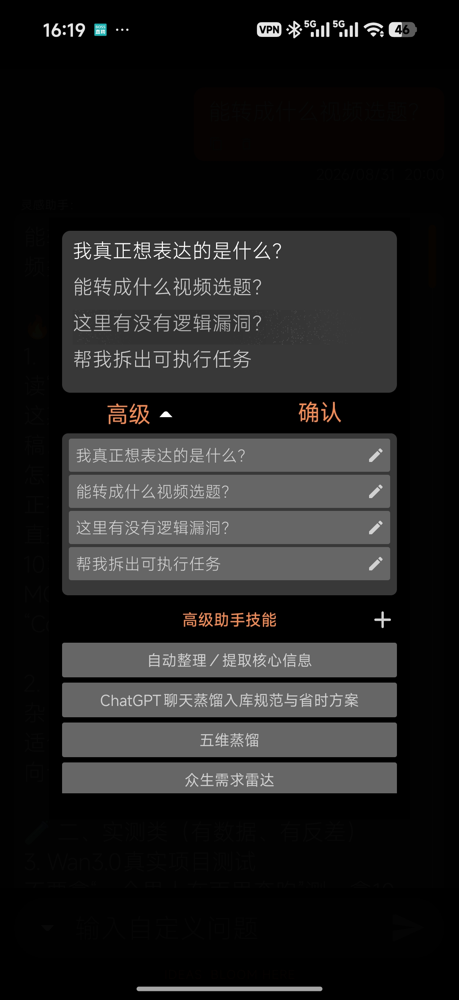
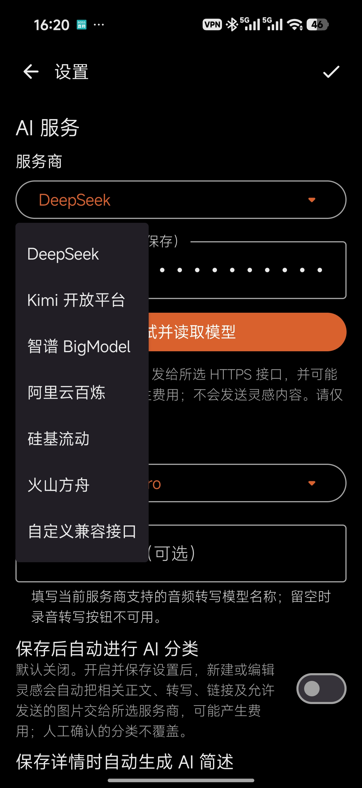
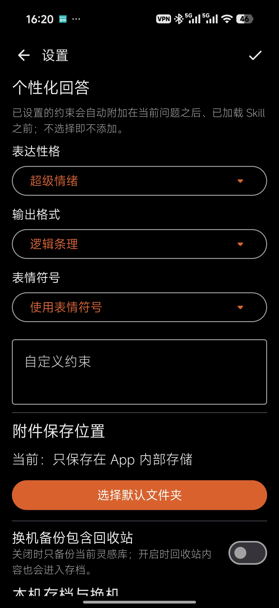

# ZapMuse · 即刻灵感

> 本仓库用于 ZapMuse 闭源 Android 软件的早期试用分发与问题反馈，不提供应用源码。安装包正在准备发布，请以 Releases 中实际可下载的附件为准。

有想法时先留下来，方便时再整理。

面向 Android 手机的灵感记录工具。把文字、链接、录音、图片和视频放进同一条灵感，再按需调用自己配置的 AI 服务提炼、分类和追问。

## 它想解决什么

灵感往往出现在不方便认真书写的时候：浏览网页看到一个线索、走路时冒出一句话、现场发现值得保存的画面。普通备忘录能够记录文字，但链接、录音、照片、视频和后续思考很容易散落在不同地方。

ZapMuse 把过程分成两步：**当下尽快留下原始信息，之后再集中整理和回顾。** AI 是可选的整理助手，不会代替或覆盖你的原始记录。

## 核心特色

- **更快进入记录**：打开 App 直接到首页；也可从系统快捷磁贴进入，或把网页和其他 App 的内容分享到 ZapMuse。
- **一条灵感容纳多种材料**：正文、来源链接、录音、图片和视频放在一起，保留产生想法时的上下文。
- **先保存，再让 AI 帮忙**：保存后可主动追问、提炼和分类；自动分类默认关闭，各自动能力由用户自行选择。
- **形成自己的灵感档案**：按关键词、标签和日期查找，回看记录及 AI 对话，而不是让想法沉在聊天记录里。
- **数据可带走**：支持完整存档导出和导入，用于备份或换机；当前试用期限结束后这些能力受完整权限限制，请提前备份。

## 界面预览

  
  
  
  

首页与即刻记录入口 · AI 追问模板 · AI 服务设置 · 个性化与备份设置

以上为 0.1.43-alpha 实机截图。为保护真实记录内容，当前未公开档案库与日历截图；后续补拍使用演示数据的“即刻记录—详情整理—档案检索”完整流程。

## 使用方式

1. 从首页、系统快捷磁贴，或其他 App 的分享菜单进入记录。来源 App 决定可分享哪些内容。
2. 保存文字与附件，在详情页编辑、加标签；需要时向 AI 提问。
3. 在档案库中搜索和回顾，定期导出存档备份。

AI 需要自行配置兼容的 HTTPS 接口及 API Key，并完成连接测试。接口费用由服务商收取，不包含在软件授权中。保存后自动分类默认关闭，可以在设置中选择启用。

## 下载与安装

候选版本：**0.1.43-alpha**，支持 **Android 10 及以上**，仅 Android 手机端。

从本仓库的 [Releases](https://github.com/bochuan0808/ZapMuse-Downloads/releases) 下载 `.apk` 安装文件，不要下载用于仓库说明的 Source code 压缩包作为安装包。如果列表为空，表示安装包尚未发布。

- 文件名：`ZapMuse-v0.1.43-alpha.apk`
- 大小：45,539,837 字节，约 45.5 MB。
- SHA-256：`07465B91C5FE5C3A20A8B82D90C63C245B5CF741FD3F695BA3D2048225517B51`

升级前请备份重要记录。正常升级直接覆盖安装；若提示签名不一致，不要先卸载或清空数据，应联系作者确认。不要随意关闭手机安全防护来处理报错。

## 试用与授权

- 首次安装起连续 30 天试用；不是不限期全功能免费。
- 试用到期进入基础模式，高级功能受限。**当前存档导入、导出也受完整权限限制，请在试用到期前备份。**
- 永久授权绑定所解锁手机，供购买者本人使用；解锁后不再受试用期限及试用功能限制。允许用于学习、工作和商业创作。
- 换机提供新机器码及既往购买凭证，经作者核验后免费重发注册码，无需再次购买授权。
- 购买前与作者确认价格、收款、交付及售后规则，并保留凭证；不要向 APK 转载者购买。

详情见[使用与转载许可](TERMS.md)。软件闭源，对外提供安装包不等于公开源码或授予修改、转售权。

## 隐私与数据

记录主要保存在本机，但可能按设备设置进入 Android 系统备份或设备迁移。主动调用 AI，或开启并保存自动功能后，相关内容会发送给所选服务商；关闭功能无法撤回已经发送的数据。

手动导出存档不是默认加密文件，请妥善保管。API Key 不放进手动换机存档。更多内容见[数据与隐私说明](PRIVACY.md)，使用前也请查看 App 内说明和 AI 服务商政策。

## 分享与反馈

欢迎分享正式发布链接。允许免费转载作者公开发布的原始 APK，须注明 ZapMuse（即刻灵感）、原作者 BoChuanOnline 和对应官方发布链接，不得修改、收费或冒充官方。

问题可通过 Issues 反馈，或联系作者。不要把私人记录、API Key、机器码、注册码、购买凭证上传到公开 Issues；截图请先打码。

- 作者 / 微信 ID：**BoChuanOnline**
- 邮箱：**281690291@qq.com**

本版本仍为 Alpha。已完成的自动测试不保证所有机型无故障，请保留备份。更新内容见[版本记录](CHANGELOG.md)。

